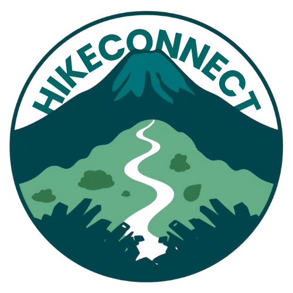

# HikeConnect

<p align="center">
  
</p>

<p align="center">
  <strong>Your Gateway to Batangas Mountains</strong>
</p>

<p align="center">
  <a href="#features">Features</a> •
  <a href="#mountains">Mountains</a> •
  <a href="#about">About</a> •
  <a href="#contributing">Contributing</a>
</p>

---

## About HikeConnect

HikeConnect is a web-based community platform dedicated to connecting hiking enthusiasts with famous hiking destinations in Batangas, Philippines. Our mission is to make mountain information accessible, connect hikers, and promote safe and sustainable hiking practices.

### Featured Mountains
- **Mt. Batulao** (811 MASL) - Beginner-friendly with rolling hills and stunning views
- **Mt. Pico de Loro** (664 MASL) - Famous for its iconic monolith
- **Mt. Talamitam** (630 MASL) - Great for day hikes with open trails
- **Mt. Masapinit** - Challenging peaks for experienced trekkers

---

## Features

### 🗺️ Comprehensive Trail Guides
Access detailed information about every hiking trail in Batangas, including difficulty levels, estimated time, trail conditions, and points of interest.

### 👥 Community Connection
Connect with fellow hiking enthusiasts, find hiking buddies, and join group treks. Share experiences and learn from seasoned hikers.

### 🛡️ Safety Resources
Stay safe with comprehensive safety guidelines, weather updates, emergency contacts, and real-time alerts about trail conditions.

### 📸 Photo Sharing
Share your hiking adventures through photos and inspire others. Browse stunning images from Batangas' most beautiful peaks.

### 📅 Event Management
Discover and join organized hiking events, clean-up drives, and community gatherings. Create your own events and build the community.

### ⭐ Trail Reviews & Tips
Read honest reviews from fellow hikers, get insider tips, and share your own experiences to help others plan their adventures.

---

## Who Can Join?

Anyone passionate about hiking, from **beginners to experienced trekkers**, can join our community. Whether you're looking for:
- Scenic beginner trails
- Challenging peaks
- Group hiking experiences
- Trail information and maps
- Hiking buddies

HikeConnect welcomes all outdoor enthusiasts!

---

## Trusted Partners & Supporters

- 🏛️ **DENR** - Department of Environment and Natural Resources
- 🌴 **Tourism Batangas** - Provincial Tourism Office
- 🥾 **Philippine Hiking Society** - National hiking community
- 🧭 **Trail Blazers PH** - Trail conservation advocates
- 🛡️ **Mt. Safe Philippines** - Hiking safety organization
- 🌿 **Eco Warriors** - Environmental protection group

---

## Technology Stack

- **Framework:** Laravel 12
- **Frontend:** Blade Templates with custom CSS
- **Language:** PHP 8.2+
- **Database:** MySQL/PostgreSQL
- **Server:** Apache/Nginx

---

## Installation

### Requirements
- PHP 8.2 or higher
- Composer
- MySQL or PostgreSQL
- Node.js & NPM (optional)

### Setup

```bash
# Clone the repository
git clone https://github.com/yourusername/hikeconnect.git
cd hikeconnect

# Install dependencies
composer install

# Copy environment file
cp .env.example .env

# Generate application key
php artisan key:generate

# Configure your database in .env file
# DB_CONNECTION=mysql
# DB_HOST=127.0.0.1
# DB_PORT=3306
# DB_DATABASE=hikeconnect
# DB_USERNAME=root
# DB_PASSWORD=your_password

# Run migrations
php artisan migrate

# Start the development server
php artisan serve
```

Visit `http://localhost:8000` to see the application.

---

## Project Structure

```
HikeConnectWebSystem/
├── app/                    # Application logic
├── bootstrap/              # Framework bootstrap
├── config/                 # Configuration files
├── database/               # Migrations and seeds
├── public/                 # Public assets
│   └── images/             # Mountain photos & logos
├── resources/
│   ├── views/              # Blade templates
│   └── Pictures/           # Raw image assets
├── routes/                 # Route definitions
├── storage/                # Logs and cache
└── tests/                  # Unit tests
```

---

## Contributing

We welcome contributions from the community! Here's how you can help:

1. **Fork** the repository
2. **Create** a feature branch (`git checkout -b feature/amazing-feature`)
3. **Commit** your changes (`git commit -m 'Add amazing feature'`)
4. **Push** to the branch (`git push origin feature/amazing-feature`)
5. **Open** a Pull Request

### Ways to Contribute
- 🐛 Report bugs and issues
- 💡 Suggest new features
- 📝 Improve documentation
- 🎨 UI/UX improvements
- 🔒 Security enhancements

---

## Safety Guidelines

HikeConnect promotes responsible hiking:

- ✅ Register your trips with local authorities
- ✅ Hike in groups when possible
- ✅ Follow Leave No Trace principles
- ✅ Check weather conditions before hiking
- ✅ Bring essential gear and first aid
- ✅ Respect local communities and wildlife

---

## Contact

- **Website:** [hikeconnect.com](https://hikeconnect.com)
- **Email:** info@hikeconnect.com
- **Instagram:** [@hikeconnect](https://instagram.com/hikeconnect)
- **Facebook:** [HikeConnectPH](https://facebook.com/HikeConnectPH)

---

## License

HikeConnect is open-sourced software licensed under the [MIT license](https://opensource.org/licenses/MIT).

---

<p align="center">
  <strong>Do what you love - Hiking. Leave the rest to us. 🥾</strong>
</p>

<p align="center">
  Made with ❤️ by the HikeConnect Team
</p>